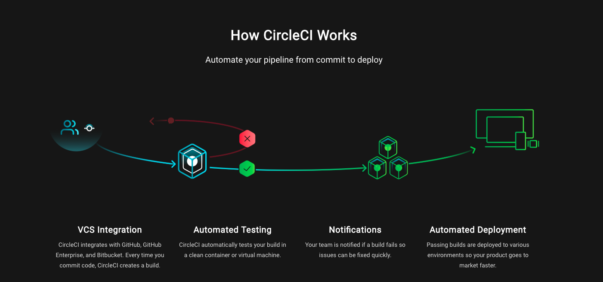

# CircleCI 
## Continuous Integration and Delivery

*"CircleCI allows teams to rapidly build quality projects, at scale. Our mission is to give people everywhere the power to build and deliver software at the speed of imagination."*

CircleCI allows teams to rapidly release code they trust by automating the build, test, and delivery process. Thousands of leading companies, including Facebook, Kickstarter, Spotify, Lyft, Palantir, Coinbase, Expedia, Stitch Fix, and Dollar Shave Club rely on CircleCI to accelerate delivery and improve quality."

## CircleCI is compatible with:

* Python, Node.js, Ruby, Java, Go, etc
* Ubuntu (12.04, 14.04), Mac OS X (paid accounts)
* Github, Bitbucket
* AWS, Azure, Heroku, Docker, dedicated server
* Jira, HipChat, Slack

## How to setup CircleCI in your next project
1. Signup at https://circleci.com/ (Can signup with Github)
2. Add project (shows all of your Github repositories. Can only start a project on a Github or Bitbucket project)
3. Create .circleci directory in the root of the repository. 
4. Inside of that directory, create a config.yml file. This tells CircleCI to run automated tests on this repository for each code change.
5. You are now set up and can review the success of failure of each commit on the "Builds" page. 

## Our Findings
Would you recommend it as a solution to the problem it states it solves? 

* Yes! Helps with "integration hell" by running frequent tests on small code changes. 

Would you use it in your project? 

* Yes!

Would it significantly increase your skill set?

* Not neccessarily - makes projects among many developers run more smoothely but doesn't teach new technology.

# It's fast, easy, and free. And there's a place for you to store your API tokens!

## Resources

https://circleci.com/

https://circleci.com/docs/

https://medium.com/circleci
